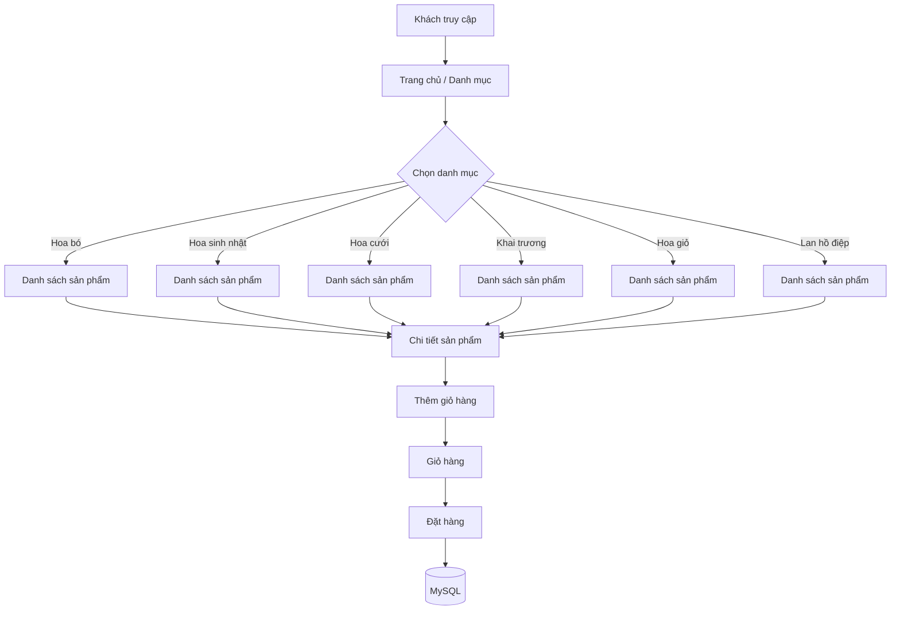
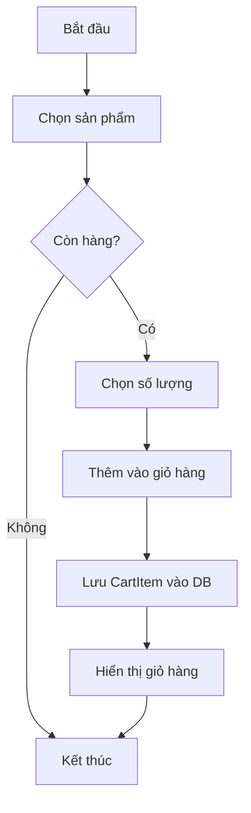
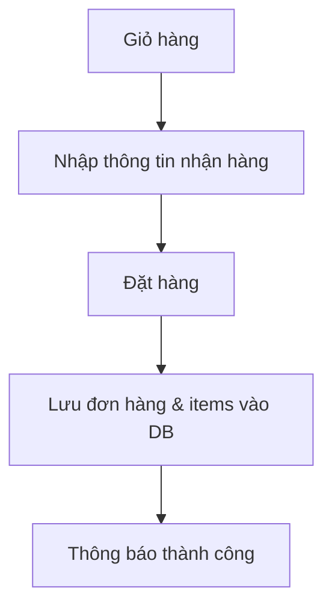

# 🌸 Mộc Hoa – Flower Shop (Laravel + Tailwind + MySQL)
Họ tên: Đỗ Như Phú - 23010553

        Lục Thị Thu Hằng -23010137

Lớp: Thiết kế web nâng cao-1-1-25(COUR01.TH7)

Môn: Thiết kế web nâng cao

# 🔎 Giới thiệu Project

- Đây là ứng dụng bán hoa online xây dựng bằng **Laravel + Tailwind CSS + MySQL**.

- Website cung cấp danh mục hoa (hoa bó, sinh nhật, cưới, khai trương, hoa giỏ, lan hồ điệp), tìm kiếm, xem chi tiết, giỏ hàng và đặt mua.
## 🎯 Chức năng chính
- Đăng ký / Đăng nhập (Breeze).

- Duyệt danh mục và sản phẩm.

- Tìm kiếm sản phẩm theo từ khoá.

- Giỏ hàng: thêm/xoá/cập nhật số lượng.

- Xem chi tiết sản phẩm.

- Seeder dữ liệu mẫu (sản phẩm & danh mục).

- Bảo mật CSRF, validate form theo route.

- Giao diện responsive (Tailwind CSS).
# 🗺️ Sơ đồ Dự Án (Mermaid)
## Cấu trúc tổng quan

## Luồng thêm sản phẩm (Add to cart)

## Luồng thanh toán đơn giản

# 🖼️ Ảnh chụp màn hình

## Trang chủ / Danh mục

## Danh sách sản phẩm

## Chi tiết sản phẩm

## Giỏ hàng

# 💡 Code minh họa
- Model

- Controller

- View

# Youtube demo
https://youtu.be/ddYPu8Svihc
